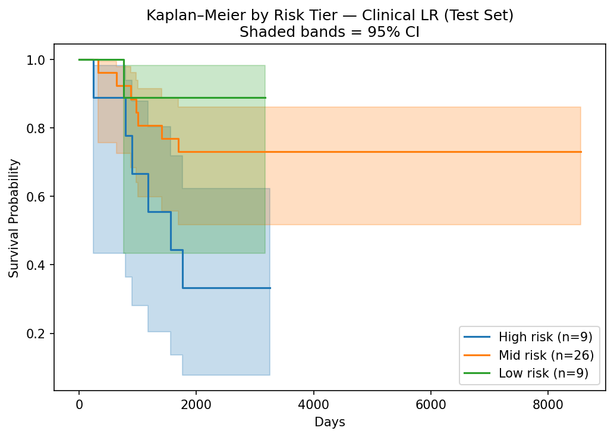

# Multimodal Breast Cancer Survival Prediction: A Six-Model Comparison

- 5-year survival prediction in TCGA breast cancer (n=290) using clinical features and RNA-seq
- Compares logistic regression, XGBoost, and attention-based deep learning fusion
- Evaluates when added model complexity improves predictive performance at small sample sizes
- Reproducible Makefile pipeline with train-only preprocessing and formal leakage checks

---

**Endpoint:** 5-year overall survival (binary: death within 5 years vs. alive with ≥5 years follow-up). Censored patients (alive with <5 years follow-up) are excluded to minimize label ambiguity, yielding n=290 after filtering (~33% event rate).

**Challenge:** High-dimensional RNA features relative to a small effective cohort (n=203 training samples). This is a regime where deep learning is not expected to dominate simpler models.

---

## Results

Six models were compared, from a majority-class null baseline to a custom attention fusion network, to measure the contribution of each data modality and added model complexity.

| Model | Val AUC | Val AP | Test AUC | Test AP |
|---|---|---|---|---|
| Majority class | 0.500 | 0.326 | 0.500 | 0.318 |
| Clinical LR | 0.884 | 0.826 | 0.786 | 0.675 |
| RNA LR | 0.719 | 0.582 | 0.614 | 0.474 |
| XGBoost (concat) | 0.786 | 0.687 | 0.671 | 0.475 |
| Deep concat MLP | 0.692 | 0.587 | 0.674 | 0.584 |
| Attention fusion | 0.643 | 0.528 | 0.662 | 0.518 |

**Clinical LR is the strongest model** (test AUC 0.786, AP 0.675). Deep learning models underperform at this sample size, consistent with the broader literature on deep learning in small biomedical cohorts. The multimodal models are included as architectural demonstrations rather than optimized production models.

Top-20% risk capture (test set):

| Model | High-risk event rate | Low-risk event rate |
|---|---|---|
| Majority class | N/A | N/A |
| Clinical LR | 0.667 | 0.111 |
| RNA LR | 0.556 | 0.222 |
| XGBoost (concat) | 0.444 | 0.000 |
| Deep concat MLP | 0.444 | 0.333 |
| Attention fusion | 0.667 | 0.000 |

**Kaplan–Meier Survival Curves (Clinical LR, Test Set)**



High-risk patients (top 20% by predicted probability) have significantly worse 5-year survival than low-risk patients (log-rank p=0.028).

*Full analysis report: [reports/09_analysis_and_model_selection.html](reports/09_analysis_and_model_selection.html)*

---

## Engineering

- Fully reproducible from raw data to final predictions via a single `make pipeline` command
- All preprocessing parameters fit on the training partition only, with formal leakage checks before finalizing any feature set
- Every model artifact saved with provenance metadata covering split sizes, feature counts, and hyperparameters
- Unit tests and GitHub Actions CI run automatically on every commit

---

## Setup and Reproducing the Pipeline

```bash
conda env create -f environment.yml  # Python 3.10
conda activate tcga-multimodal-survival
```

Data download (public, no credentials required):

```bash
bash scripts/download_data.sh
```

Then run the full pipeline:

```bash
make pipeline
```

To run individual steps:

```bash
make split
make preprocess-clinical
make preprocess-rna
make assemble
make train-baselines
make train-xgboost
make train-multimodal
```

Run `make help` to see all available targets. Each script has a corresponding development notebook in `notebooks/`.

---

## Project Structure

```
data/
├── raw/                        # Immutable source files (never modified)
├── interim/                    # Cohort definition: sample IDs, feature manifests, preprocessing parameters
├── processed/                  # Model-ready outputs (split applied, preprocessing fit on train)
│   ├── splits/                 # Train/val/test sample ID CSVs
│   ├── clinical/               # Preprocessed clinical feature matrices (train/, val/, test/)
│   ├── rna/                    # Preprocessed RNA feature matrices (train/, val/, test/)
│   └── assembled/              # Aligned, merged feature matrices ready for modeling (train/, val/, test/)
└── tests/                      # Ephemeral outputs from notebook dev/smoke tests

models/
├── baselines/                  # Logistic regression artifacts, predictions, and metrics
├── xgboost/                    # XGBoost artifacts, predictions, SHAP values, and metrics
└── multimodal/                 # Concat MLP and attention fusion artifacts, predictions, and metrics

notebooks/                      # Step-by-step development notebooks (01–09)
scripts/                        # Reusable pipeline modules (CLI entry points)
reports/                        # Figures and analysis outputs
tests/                          # Unit tests (pytest)
```

Each notebook has a corresponding script in `scripts/`. The notebook is the development and guide artifact; the script is the reproducible CLI entry point.

1. **Data preparation** (`01_data_prep.ipynb`): cohort definition, QC, modality alignment
2. **Split creation** (`02_create_split.ipynb`): stratified train/val/test split, leakage safeguards
3. **Clinical preprocessing** (`03_preprocess_clinical.ipynb`): imputation, encoding, leakage checks; all parameters fit on train only
4. **RNA preprocessing** (`04_preprocess_rna.ipynb`): filtering, log transform, train-only scaling
5. **Dataset assembly** (`05_assemble_dataset.ipynb`): align modalities, construct targets, validate
6. **Baseline models** (`06_train_baselines.ipynb`): clinical-only and RNA-only logistic regression
7. **XGBoost benchmark** (`07_train_xgboost.ipynb`): nonlinear multimodal benchmark with SHAP
8. **Deep learning** (`08_train_multimodal.ipynb`): MLP encoders, concatenation fusion, attention fusion
9. **Analysis and model selection** (`09_analysis_and_model_selection.ipynb`): cross-model comparison, Kaplan–Meier survival curves, SHAP interpretability, final recommendation

---

## Design Decisions

### Why BRCA
- One of the larger public multimodal cohorts available (~1,200 patients before filtering), though still too small for deep learning to shine
- High overlap across RNA, clinical, and survival data
- Sufficient primary tumor samples after QC
- Adequate event count for 5-year survival modeling (~100 events)
- Biologically heterogeneous disease, making multimodal integration meaningful
- Well-characterized TCGA cohort commonly used in benchmarking

### 5-Year Overall Survival Definition
- **Event (label = 1):** death within 5 years
- **Survivor (label = 0):** alive with ≥ 5 years of follow-up
- **Excluded:** alive with < 5 years follow-up (censored before cutoff)

Rationale: minimizes label ambiguity from censoring, provides a clinically meaningful endpoint, maintains adequate event rate (~33%), and preserves sufficient cohort size (n=290).

### Why TPM for RNA
TCGA log2(count + 1) values are not library-size normalized, so sequencing depth differences remain. TPM is library-size normalized, reducing global shifts across patients. After log transformation and train-only z-scoring, TPM provides a stable input for ML models.

What would be fully optimal (if reprocessing from raw): start from raw counts, normalize with DESeq2/TMM size factors, apply VST, split before any statistical filtering, fit all scaling on train only.

### Deep Learning Hyperparameter Tuning
Hyperparameter tuning was applied to XGBoost but not the deep learning models. With n=203 training samples, the primary constraint is sample size rather than architecture or regularization choices. A grid search over dropout rates, learning rates, or embedding dimensions would not address the fundamental parameter-to-sample ratio problem. The deep learning models are included as architectural demonstrations of multimodal fusion, not as optimized production models.

### Model Comparison Design

Each model represents a step up in complexity:

- **Clinical LR:** interpretable baseline using well-established clinical risk factors
- **RNA LR:** tests whether gene expression adds signal beyond clinical features
- **XGBoost (concat):** nonlinear model on combined modalities
- **Deep concat MLP:** learned representations via neural encoders
- **Attention fusion:** per-patient modality weighting via learned attention

This is a model comparison rather than a strict ablation. Each step changes multiple things at once (architecture, training procedure, feature set), so individual contributions cannot be cleanly isolated. The progression is designed to answer a practical question: at what point does added complexity stop paying off?

### Leakage Controls
- Train/val/test split is created once and saved; all preprocessing parameters are fit on the train partition only
- Clinical imputation medians, OHE categories, and RNA scaling parameters are derived from training data and applied unchanged to val and test
- Target leakage columns (`vital_status`, `treatment_or_therapy`) are explicitly dropped before any feature encoding
- Formal leakage check in `03_preprocess_clinical.ipynb` correlates candidate features with the outcome label before finalizing the feature set

---

## Limitations and Future Work

- **Sample size:** n=203 training samples is the primary bottleneck. Deep learning models require larger cohorts to outperform regularized linear models.
- **Attention weight collapse:** the attention fusion model's softmax saturates to near-exact 0/1 weights due to a scale mismatch between modalities (raw clinical scores mean −69 vs RNA mean +2), effectively forcing single-modality predictions. Modality-specific normalization before the attention layer would address this.
- **RNA preprocessing:** TPM values are taken from TCGA's preprocessed output rather than recomputed from raw counts. Starting from raw reads with DESeq2/VST normalization would be more rigorous.
- **Censoring:** patients censored before 5 years are excluded rather than modeled. A Cox proportional hazards model would make full use of censored observations.
- **Single cohort:** all results are from TCGA BRCA. Generalization to other cohorts or cancer types is untested.
